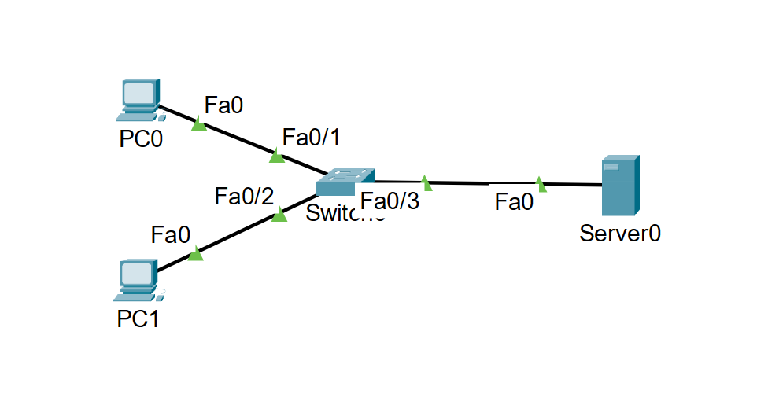

# packet-tracer-lab
Packet Tracer→Springアプリ→Azure→Nmapのラボ構築ポートフォリオ用のリポジトリ

# WhiteHacker Portfolio: PacketTracer Lab #1

## 目的
未経験からホワイトハッカーへ。Packet Tracerでセキュアネットワーク基盤構築→Springアプリ→Azure→Nmapスキャン

## Lab1:基本LAN構築
- **デバイス構成**：PC0（PC）、PC1（PC）、Server（PT-Server）、Switch（2960-24TT）
- **接続**：Copper Straight-Throughケーブル（PC0-Fa0/1、PC1-Fa0/2、Server-Fa0/3）
- **IP設定**
  | デバイス | IPv4 Address | Subnet Mask | Default Gateway |
  |----------|--------------|-------------|-----------------|
  | PC0 | 192.168.1.10 | 255.255.255.0 | 192.168.1.1 |
  | PC1 | 192.168.1.20 | 255.255.255.0 | 192.168.1.1 |
  | Server | 192.168.1.100| 255.255.255.0 | 192.168.1.1 |

  ## 検証結果
  ✅ PC0 ↔ PC1 ping成功  
  ✅ PC0 → Server Webアクセス成功 (Cisco Packet Tracerページ表示)

<table align="center">
  <tr>
    <td align="center"></td>
    <td align="center"></td>
  </tr>
  <tr>
    <td align="center"></td>
    <td align="center"></td>
  </tr>
</table>

  ## Next：ルーター追加＋ACL設定→Spring Bootアプリ展開
